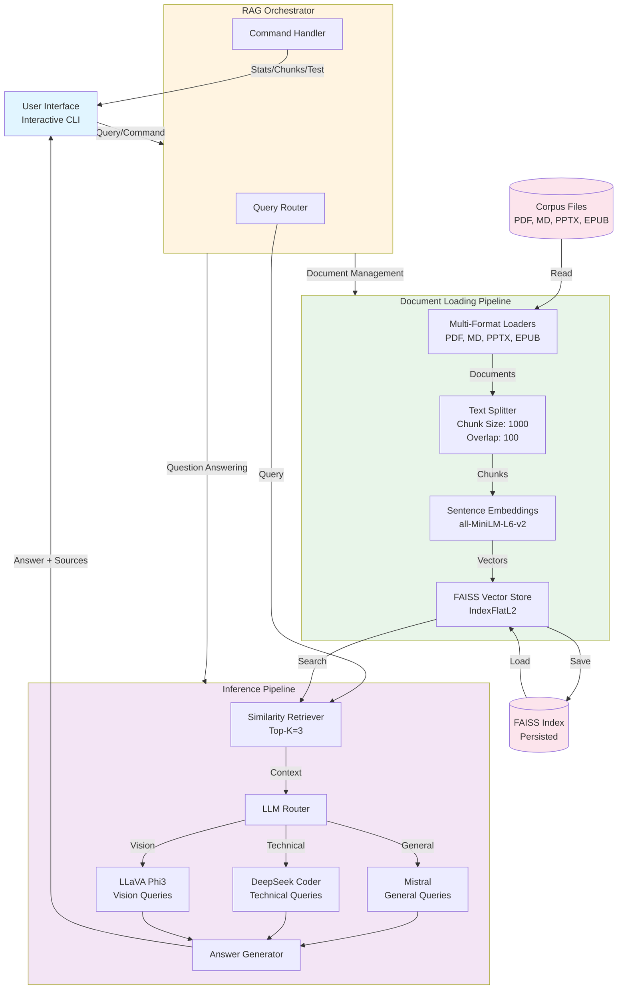

# RAG System Architecture

## High-Level Architecture

## Component Interaction Flow

### Document Ingestion Flow
1. **Corpus Scanning**: System scans `./corpus/` and `./data/` directories
2. **Format Detection**: Identifies file types (PDF, MD, PPTX, EPUB)
3. **Document Loading**: Format-specific loaders extract text + metadata
4. **Text Splitting**: RecursiveCharacterTextSplitter creates chunks (1000 chars, 100 overlap)
5. **Embedding Generation**: SentenceTransformer creates 384-dim vectors
6. **Index Building**: FAISS IndexFlatL2 stores vectors for similarity search
7. **Persistence**: Index saved to `./faiss_store/rag_300818959/`

### Query Processing Flow
1. **User Input**: User submits natural language query
2. **Command Check**: Router checks for special commands (`:stats`, `:chunks`, etc.)
3. **Vector Search**: Query embedded → FAISS finds top-K similar chunks
4. **Context Retrieval**: Top-3 chunks retrieved with metadata (source, page)
5. **LLM Selection**: Router chooses model based on query keywords
   - Technical keywords → DeepSeek Coder
   - Vision keywords → LLaVA Phi3
   - Default → Mistral
6. **Answer Generation**: LLM synthesizes answer from retrieved context
7. **Source Citation**: System returns answer with source references

### Auto-Rebuild Mechanism
- **Trigger**: File modification time newer than FAISS index timestamp
- **Action**: Automatic re-ingestion and re-indexing
- **Control**: Configurable via `REBUILD_IF_NEWER=true` in `.env`

## Key Design Decisions

### Why FAISS over ChromaDB?
- **Performance**: FAISS optimized for similarity search (Facebook AI Research)
- **Offline**: No external dependencies, runs completely local
- **Simplicity**: Lightweight, easy to persist and load
- **Trade-off**: Less feature-rich than ChromaDB but sufficient for assignment

### Why Ollama over MistralAI API?
- **Privacy**: All processing local, no data sent to cloud
- **Cost**: Free, no API tokens required
- **Offline**: Works without internet connection
- **Trade-off**: Slower inference, lower quality than cloud GPT-4/Claude

### Why Multi-Model Routing?
- **Specialization**: DeepSeek excels at code, LLaVA handles images
- **Quality**: Task-appropriate models produce better answers
- **Flexibility**: Easy to add new models for specific domains

### Why RecursiveCharacterTextSplitter?
- **Semantic Coherence**: Tries to split on sentence/paragraph boundaries
- **Overlap**: 100-char overlap prevents context loss at boundaries
- **Configurable**: Chunk size tunable via `.env`
