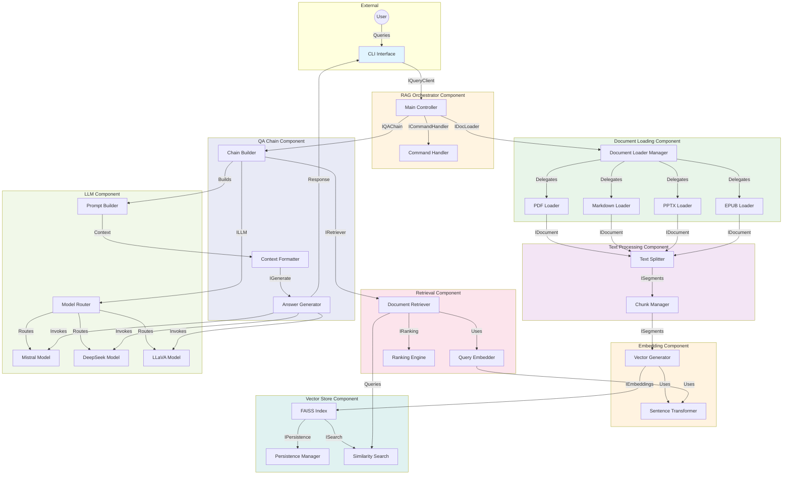

# UML Component Diagram

## System Components and Interfaces



## Interface Definitions

### External Interfaces

#### IQueryClient
```python
class IQueryClient:
    """External interface for user interaction"""
    def submit_query(query: str) -> str
    def execute_command(command: str) -> str
    def get_sources() -> List[str]
```

### Internal Interfaces

#### IDocLoader
```python
class IDocLoader:
    """Document loading interface"""
    def load_documents(paths: List[Path]) -> List[Document]
    def supports_format(extension: str) -> bool
    def get_metadata(document: Document) -> Dict[str, Any]
```

#### ISegments
```python
class ISegments:
    """Text segmentation interface"""
    def split_documents(docs: List[Document]) -> List[Document]
    def get_chunk_size() -> int
    def get_overlap() -> int
```

#### IEmbeddings
```python
class IEmbeddings:
    """Embedding generation interface"""
    def embed_documents(texts: List[str]) -> List[List[float]]
    def embed_query(text: str) -> List[float]
    def get_dimension() -> int
```

#### IVectorStore
```python
class IVectorStore:
    """Vector storage and retrieval interface"""
    def add_vectors(vectors: List[List[float]], metadata: List[Dict]) -> None
    def similarity_search(query_vector: List[float], k: int) -> List[Document]
    def save(path: Path) -> None
    def load(path: Path) -> None
```

#### IRetriever
```python
class IRetriever:
    """Document retrieval interface"""
    def get_relevant_documents(query: str) -> List[Document]
    def invoke(input: Dict) -> List[Document]
    def get_top_k() -> int
```

#### ILLM
```python
class ILLM:
    """Language model interface"""
    def generate(prompt: str) -> str
    def invoke(messages: List[Dict]) -> str
    def get_model_name() -> str
```

#### IQAChain
```python
class IQAChain:
    """Question-answering chain interface"""
    def invoke(input: Dict[str, str]) -> Dict[str, Any]
    def get_retriever() -> IRetriever
    def get_llm() -> ILLM
```

#### ICommandHandler
```python
class ICommandHandler:
    """Command handling interface"""
    def handle_stats() -> str
    def handle_chunks(filter: str) -> str
    def handle_test() -> str
    def handle_summary(filter: str) -> str
```

#### IPersistence
```python
class IPersistence:
    """Persistence management interface"""
    def save_index(index: Any, path: Path) -> None
    def load_index(path: Path) -> Any
    def index_exists(path: Path) -> bool
    def get_index_timestamp(path: Path) -> float
```

#### ISecrets
```python
class ISecrets:
    """Configuration and secrets interface"""
    def get_env(key: str, default: Any = None) -> Any
    def get_student_info() -> Dict[str, str]
    def get_model_config() -> Dict[str, str]
```

## Design Patterns Applied

### 1. Strategy Pattern
**Component**: LLM Router (Model Selection)
- **Context**: `choose_llm(query)` function
- **Strategies**: Mistral (general), DeepSeek (technical), LLaVA (vision)
- **Selection Logic**: Keyword detection in query text
- **Benefit**: Easy to add new models without modifying orchestrator

### 2. Pipeline Pattern
**Components**: Loading Pipeline, Inference Pipeline
- **Loading**: Load → Split → Embed → Index
- **Inference**: Retrieve → Generate → Format
- **Benefit**: Clear separation of concerns, testable stages

### 3. Repository Pattern
**Component**: FAISS Vector Store
- **Interface**: `build_vectorstore()`, `load_vectorstore()`
- **Persistence**: Abstracted save/load operations
- **Benefit**: Swap FAISS for ChromaDB/Pinecone without changing orchestrator

### 4. Facade Pattern
**Component**: SimpleRetrievalQA
- **Simplification**: Hides LangChain version complexity
- **Unified Interface**: `invoke({"query": q})` works across versions
- **Benefit**: Shields application from breaking API changes

### 5. Chain of Responsibility Pattern
**Component**: Query Processing
- **Chain**: Command Check → Query Embedding → Retrieval → LLM Selection → Generation
- **Handler**: Each stage processes or passes to next
- **Benefit**: Flexible query handling with early exits for commands

### 6. Factory Pattern
**Component**: Document Loaders
- **Factory**: `load_documents()` function
- **Products**: PDFLoader, MDLoader, PPTXLoader, EPUBLoader
- **Selection**: Based on file extension
- **Benefit**: Easy to add new format loaders

### 7. Template Method Pattern
**Component**: `_summarize_chunks()` multi-stage summarization
- **Template**: Batch → Partial Summaries → Combine → Final Synthesis
- **Variants**: Different batch sizes, LLM models
- **Benefit**: Handles large corpora without token limit errors

## Component Responsibilities

### Orchestrator Component
- Main event loop and user interaction
- Command routing (:stats, :chunks, :test, etc.)
- Coordinates loading and inference pipelines
- Error handling and logging

### Document Loading Component
- Multi-format file reading (PDF/MD/PPTX/EPUB)
- Metadata extraction (page numbers, slide numbers, chapters)
- Error handling for corrupt/invalid files
- Extensible to new formats

### Text Processing Component
- Recursive character-based text splitting
- Configurable chunk size and overlap
- Preservation of metadata across chunks
- Semantic boundary detection

### Embedding Component
- Sentence transformer model management
- Vector generation for documents and queries
- Dimension consistency (384-dim for all-MiniLM-L6-v2)
- Caching for performance

### Vector Store Component
- FAISS index creation and management
- Similarity search (L2 distance)
- Index persistence to disk
- Auto-rebuild when sources updated

### Retrieval Component
- Query embedding
- Top-K similarity search (default K=3)
- Result ranking and filtering
- Source citation tracking

### LLM Component
- Model routing based on query type
- Ollama client management
- Prompt formatting
- Response parsing

### QA Chain Component
- Retrieval-augmented generation orchestration
- Context formatting ("stuff" strategy)
- Answer synthesis
- Source document tracking

## Data Flow Example

### Example: "What are the non-functional requirements?"

```
1. User Input
   └─> "What are the non-functional requirements?"

2. Orchestrator (Main Controller)
   └─> Check if starts with ":" → No
   └─> Route to QA Chain

3. Retrieval Component
   ├─> Query Embedder: Embed query → [0.23, -0.45, 0.12, ...]
   ├─> FAISS Search: Find top-3 similar chunks
   └─> Results:
       • Chunk 42 (requirements_document.pdf, page 3): "NFR-1: System must respond within 2 seconds..."
       • Chunk 18 (AI Systems Design.md, line 156): "Non-functional requirements include..."
       • Chunk 53 (requirements_document.pdf, page 4): "NFR-2: Availability 99.9%..."

4. LLM Component
   ├─> Model Router: No "code" or "diagram" keywords → Select Mistral
   └─> Prompt Builder:
       Context: [Chunk 42, Chunk 18, Chunk 53]
       Query: "What are the non-functional requirements?"
       Template: "Use the following context to answer: {context}\nQuestion: {query}"

5. Answer Generator
   ├─> Mistral Invoke: Generate answer based on context
   └─> Response: "Based on the requirements document, the non-functional requirements are:
                   1. Response Time (NFR-1): System must respond within 2 seconds
                   2. Availability (NFR-2): 99.9% uptime guaranteed
                   [Sources: requirements_document.pdf (pages 3-4)]"

6. Orchestrator
   └─> Format and display to user with source citations
```
